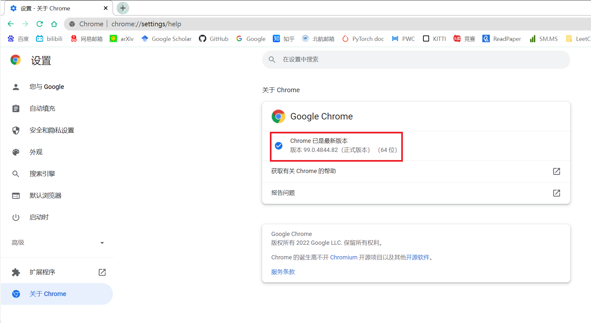

# BUAA_HSYY
北航核酸检测预约（金数据问卷）自动填写脚本

# 功能

随着核酸检测常态化，而每次填写金数据问卷时又要重复输入个人信息，还要选择困难症地随机选一个我不会按时去的时间段，于是我便想到把预约核酸检测的过程脚本化。

# 安装

本项目基于Python=3.7.11。

- 为方便使用，我非常推荐您通过conda/miniconda创建一个新的环境（如果你没有安装Conda或Python环境，请自行安装）。此处以环境名为`hsyy`为例：

```bash
conda create -n hsyy python=3.7 -y
conda activate hsyy
```

- 随后，使用repo中的requirements文件安装所需要的库。注意使用Tab键以避免一些可能的键入失误（或者直接复制粘贴对应的语句）。

```bash
pip install -r requirements.txt
```

- 之后，安装浏览器环境。虽然下文提供了其他浏览器的使用办法，但为了避免出现可能的bug，仍然建议使用Chrome浏览器。如果你没有安装Chrome浏览器，请自行安装。
- （如果浏览器内核版本更新、程序运行报错，再执行此步）检查你的Chrome浏览器版本。方式是找到右上角三个点，打开“设置”，找到左侧下方的“关于Chrome选项”，例如下图，我此处的版本号是99.0.4844.82。
  
  
  
  随后，根据你的浏览器版本和系统，点[此链接下载Chrome驱动内核](https://chromedriver.storage.googleapis.com/index.html)。将下载的内核文件放置在文件夹中（或替换旧的内核文件）。

您当然也可以自行尝试其他的浏览器及其内核（例如火狐、Edge、Safari等）。可以通过[Selenium的官方文档](https://www.selenium.dev/documentation/webdriver/getting_started/install_drivers/#quick-reference)以检查这些浏览器的兼容性。注意，你可能需要修改脚本对应的调用内核部分代码。

# 使用方法

1. 初次使用请在[configs.yaml](https://github.com/Muyiyunzi/BUAA_HSYY/blob/main/configs.yaml)中按照对应规则填写个人信息。
2. 修改脚本文件autoreserve.py中第11行的url地址，改为本次需要填写的问卷地址。
3. 运行`python autoreserve.py`即可。你也可以使用像PyCharm这样的IDE软件更便捷地运行脚本，或利用debug模式观察每一语句的执行效果。
4. （可选）初次使用建议你在第75行提交时加断点（或是注释掉75行及以后的全部内容），便于检查信息填写和学院选择是否正确，再手动点击提交。

# License

This Repo is released under [MIT License](https://github.com/Muyiyunzi/BUAA_HSYY/blob/main/LICENSE).

# BUG反馈

欢迎在repo中提issues反映任何问题！